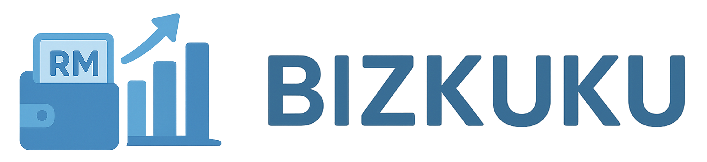

# BizKuKu - Comprehensive Support for MSMEs — from A to Z

<p align="center">
  
</p>

**Seamless MSMEs onboarding for the forgotten majority**  
Empowering MSMEs to grow, scale, and succeed with language localization and AI assistance for real-time help.

This is a [Next.js](https://nextjs.org) project built to provide comprehensive digital solutions for Micro, Small, and Medium Enterprises (MSMEs) in Malaysia.

## 🎯 Mission

Providing **ONE-STOP ONBOARDING** for low digital literacy individuals and comprehensive business support tools to help MSMEs thrive in the digital economy.

## ✨ Key Features

### 🚀 One-Stop Onboarding Platform
**Designed for low digital literacy individuals**

- **SSM Passport Registration**: Streamlined company registration process
- **E-KYC Integration**: Secure digital identity verification
- **One-Click Applications**:
  - SSM (Companies Commission of Malaysia) registration
  - Bank account opening
  - Business permit applications

### 🔐 Secure Integration Hub
- **SSM Integration**: Direct connection with Companies Commission of Malaysia
- **Multi-Bank Connectivity**: Seamless integration with major Malaysian banks
- **PSP (Payment Service Provider)** integration for comprehensive payment solutions

### 📊 Post-Onboarding Business Tools

#### Merchant Account & Finance Management
- **Real-time Financial Dashboard**: Track sales revenue, expenses, and cashflow
- **Business Analytics**: Comprehensive performance insights
- **E-Invoicing System**: Digital invoicing with automated tax record keeping
- **Digital Tax Records**: Automated compliance and record management

#### AI-Powered Business Intelligence
- **Business Improvement Suggestions**: AI-driven revenue booster recommendations
- **Financial Health Scoring**: Automated assessment of business financial status
- **Personalized Recommendations**: Tailored advice based on business profile and performance

### 💰 Always-On Financial Access

#### Funding Discovery Engine
- **Comprehensive Database**: Collections of subsidies, grants, and loans
- **AI-Powered Matching**: Smart recommendations to match MSMEs with relevant funding opportunities
- **Auto-Eligibility Detection**: Automatic qualification assessment based on business profile
- **One-Click Applications**: Streamlined application process for subsidies, grants, and loans


## 🚀 Getting Started

### Prerequisites
- Node.js 18+
- npm, yarn, pnpm, or bun

### Installation

1. Clone the repository:
```bash
git clone https://github.com/Shawnchee/BizKuKu.git
cd bizkuku
```

2. Install dependencies:
```bash
npm install
# or
yarn install
# or
pnpm install
```

3. Run the development server:
```bash
npm run dev
# or
yarn dev
# or
pnpm dev
# or
bun dev
```

4. Open [http://localhost:3000](http://localhost:3000) with your browser to see the result.

5. Setup Backend
```sh
cd backend
pip install -r requirements.txt
```

6. Run the Backend
```sh
uvicorn main:app --reload
```
The backend will be available at http://localhost:8000

## 🎯 Target Audience

**Primary**: Malaysian MSMEs with low digital literacy
**Focus**: Underserved communities often overlooked by traditional financial services

## 🌟 Core Value Propositions

1. **Accessibility First**: Designed for users with limited digital experience
2. **Language Inclusive**: Full localization in Bahasa Malaysia and English
3. **AI-Powered Guidance**: 24/7 intelligent assistance and recommendations
4. **Comprehensive Integration**: One platform for all business needs
5. **Financial Inclusion**: Connecting MSMEs with funding opportunities

## 📈 Future Roadmap

- Advanced AI-driven business coaching
- Marketplace integration for B2B opportunities
- Expanded funding partner network
- Mobile application development
- Regional expansion beyond Malaysia

## 🤝 Contributing

We welcome contributions to help improve BizKuKu and better serve the MSME community. Please read our contributing guidelines before submitting pull requests.

## 📄 License

This project is licensed under the MIT License - see the LICENSE file for details.

---

**BizKuKu** - Bridging the digital divide for Malaysian MSMEs, one business at